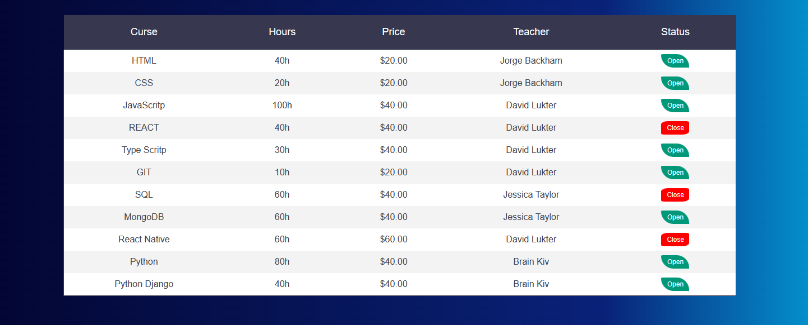

# Projeto-Iniciante-Front-05
O Projeto aqui é do nível Iniciante, utilizando HTML/CSS

 
    
    

#

#05 Tabela de Cursos

O projeto simula uma Oferta de Cursos utilizando uma Tabela como layout, o projeto foi desenvolvido por mim <b>mesmo</b>. Nele foi utilizado :

- table
- efeito de houver ao passar pelo status do produto
- background-image linear rgb
#

    

